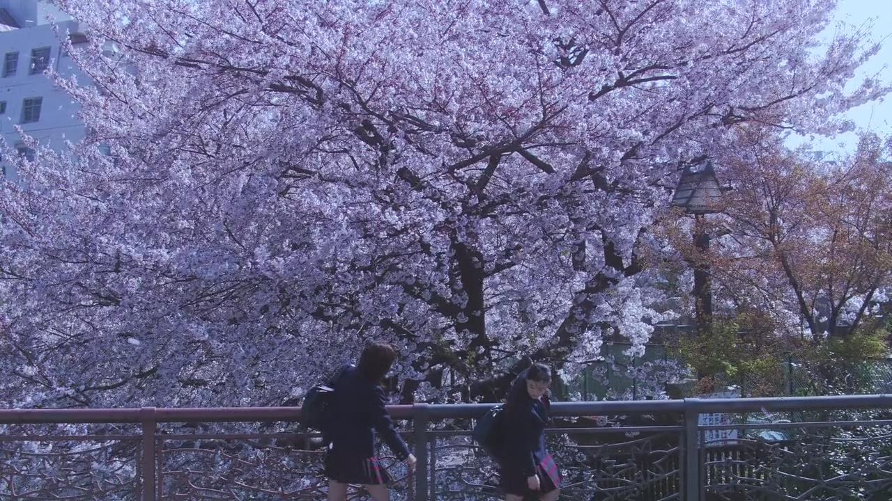
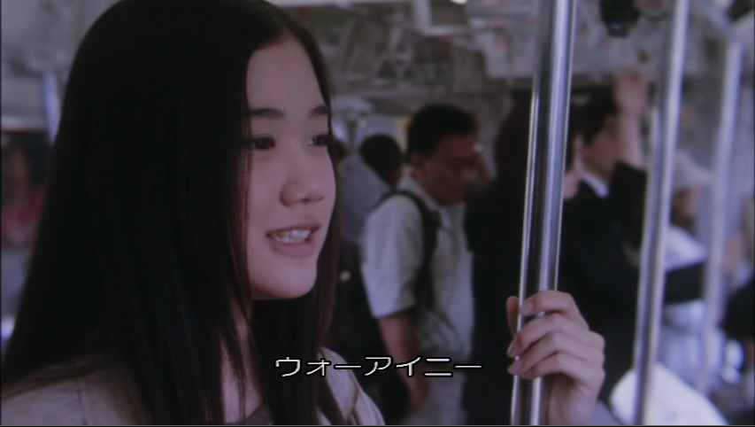

:::tip
  ウヲアイニ (我爱你)
:::

<!-- more -->

  

骤变后天气总归是有了点印象中 12 月的样子

前段时间异色木棉开满了整座羊城

学校附近的十字路口有棵玉色木棉特别耀眼

风吹过黄昏的时候 花瓣葬落在树脚下

想起花与爱丽丝里铺满樱花的山道

于是我又一次借着午后的闲暇重温了一遍

“那句中文怎么说来着？ ヲ…ヲアイ（我…我爱）”

“「我爱你」”

“爸爸，「我爱你」”

“这个时候要说「再见」，下次再见”

  

这是爱丽丝和父亲在告别的列车上的一段对话

穿插在这部青春电影中的亲情间奏

却成为了我最难忘的一幕镜头

有些话自己的母语说不出口，但是外语却可以很好地表达

不善言辞的父女互相用中文说出「我爱你」

父亲的回答只是简单的告别

却无比的契合父亲的形象

很微妙的体验，一句中文在电影里被创作者赋予如此份量的情感表达

最近读了余秀华的一本诗集

里面节选的一段我很喜欢

我身体里的火车，油漆已经斑驳

他不慌不忙，允许醉鬼，乞丐，卖艺的，或什么领袖

上上下下

我身体里的火车从来不会错轨

所以允许大雪，风暴，泥石流，和荒谬

就像青春一样

如果青春是千篇一律一成不变的做作样子

谁还会喜欢并常常追忆

岩井俊二在一次访谈中提到

“大家都叫我青春教主，说我爱拍青春少年少女的电影”

“其实不是，我只是喜欢拍笨蛋”

“笨蛋最有趣，因为我也很笨”

“而青春期就是人一生中最笨的时期，所以我拍青春期”

可能正是这样笨笨的桥段和格调

勾勒出了每个人不同青春记忆的模样

