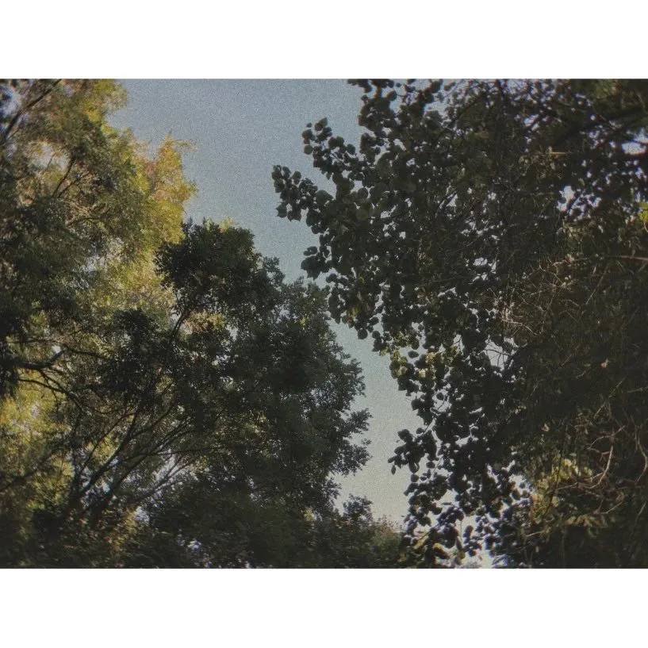
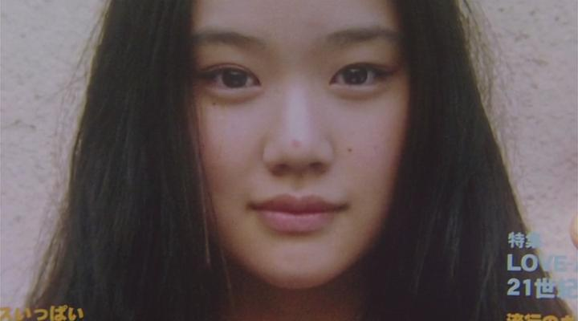

在某天晚上操场散步回来后，我脑海里突然浮现出了一个画面，是电影 🎬《花与爱丽丝》爱丽丝登上了杂志封面，她指着封面上长了青春痘的自己对着花傻傻笑着的这一幕；

大概是运动会的缘故，那天的操场很热闹，篮球场和足球场场外也都围满了人，风声卷着欢呼声，好像能飘得好远好远，理所当然，胜者为王；

经过校道隧道的时候，手机提示电池电量不足，关闭提示后看了看讯息，不经意瞄到了朋友发的动态，是各个企业发来的“非常遗憾……”的截图，把手机装进口袋的时候，看到了被咬了一口的苹果，思绪万千；

在经过学生活动中心的时候，刚好有学生在唱歌，听到声音我想起了有个五音不全的同学，某次扯着喉咙歇斯底里唱了首《安静》表白，他喜欢的那个姑娘十动然拒，为此我笑了他好久，哪有人表白唱苦情歌啊。是啊，好久不见，他的遗憾我却记了好多年；

有些道理是突然明白的，不由分说无须多言；

封面杂志上的照片是精心拍摄，应该是最美的一刻，但恰巧爱丽丝那时长了颗鼻尖上的青春痘，现在想来岩井俊二的用意大概就是让这份美残缺一部分，用遗憾裁剪出了真实的美。仔细回头看，自己记得最清晰的也并不是考试排名最高的那次，而是明明差一点就能达到目标分数目标排名的那一次，因为这一点点，那些为之幻想过为之努力过的日夜都化作乌有，这样的遗憾更明晰，哪怕是别人记忆中的胜者为王，也抵不过自己心里的败者为寇；

朋友的遗憾，在多年后再听到五音不全的调子，仍会在我记忆中筛选提取，但我会说“这就是青春啊”，那为某人奋不顾身的勇气，是在静谧的夜里想起时也会为之沸腾的；

遗憾是会饲育回忆的花朵的，日后尽量别教今天的泪白流，错误里吸收，结成果实成熟后，会是最鲜甜的那一口；

晚安:)
