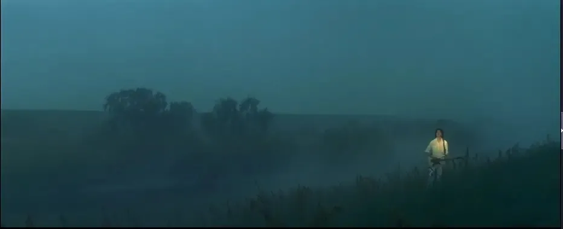

北野武把艺术解读为私人的极端的浪漫，是一种没出息的东西；

对于他的观点，我认可其中的一部分的，因为艺术作品是主观创造的，所以难免是私人的，取悦自己很多时候也是艺术家的创造初衷，但我也不能否认艺术作品给人们带来感情上的共鸣，传达出来的往往是从具象中封装出来的抽象情感，当艺术作品被看见的时候，这份抽象的情感又实例化到具体的某个观众上，情感的阀门开关被触发，艺术创造的浪漫被公有化；

再见黑鸟，是我最近读的一本书，关于告别，它算不上是一本好书，可它抽象封装表达出来的情感，在我的人生经历里匹配到了实例，于我而言他就是一本好书；

‘’不是我，却比我，拥有我‘’

‘’要好好告别，哪怕不再见‘’

‘’我们彼此浪费了一段时间啊，可浪费的这段时间，却是我最快乐的时间‘’

‘’再见，黑鸟‘’
