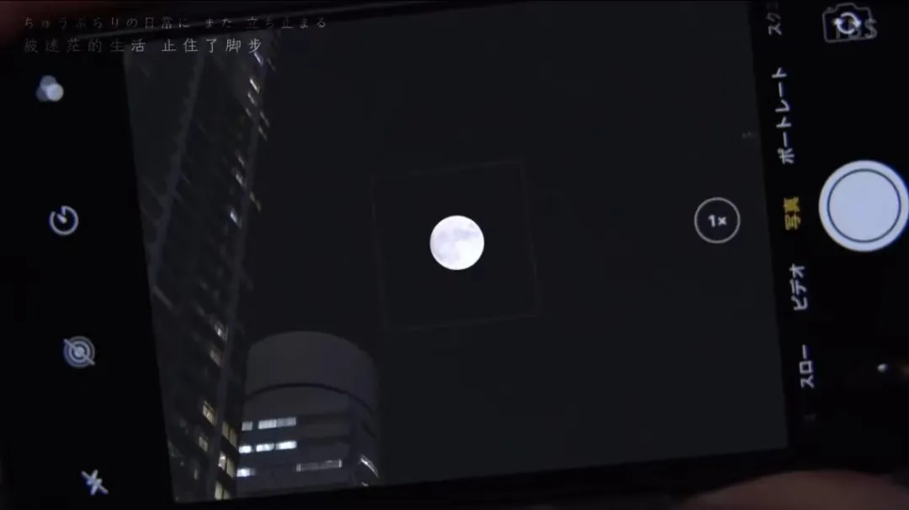

晚上好，中秋快乐，祝你快乐！

不知道過期的祝福還合不合時宜，月餅有保質期，月圓有保質期，有些團聚也有保質期，關於「保質期」，百度百科告訴我它是產品的最佳食用期，我很難過，因為好像過了中秋這個「最佳食用期」，上面列舉的這些都會過期，變得不合時宜；

印象中，每年中秋家裡都會收到很多月餅，酒樓精裝的月餅禮盒，街邊散賣零售的水果月餅，手工製作的酥皮月餅；莲蓉，豆沙，蛋黄，五仁應有盡有，那時候對中秋的最大期待大概就是應時令才能吃到的月餅了；

节前因为一些事情提前回了趟家，回到家第一件事就是觅食，问了我弟还有没有月饼，他说当早餐吃了好几天都吃完了。可我看到桌上还有两个月饼，马上揽进包里还没来得及吃就赶回学校了；

中秋那晚，在操场散步突然发现包里的月饼，咬下去的第一口才发现是五仁月饼（在我弟的胃鉴定下甚至不能被认定为月饼的饼），我也讨厌吃五仁月饼，讨厌齁甜的冬瓜糖冬瓜芯，讨厌发苦的杏仁籽，于是吃的小心翼翼；

想起小时候的五仁月饼，爸妈叔婶趋之若鹜，我和我弟避之不及，大人们说，五仁越嚼越有味，唇齿留香，小孩子不会吃不懂吃，于是往后莲蓉豆沙都归我俩兄弟，五仁被单方面开除月饼籍，父代与子代的隔阂代沟在月饼的口味争论中，可见一斑；

吃着五仁月饼的我，不知道为什么，突然想起“刻舟求剑”这个词语，小时候刚识字的时候喜欢看成语故事，那时候就觉得故事里的这个人好傻，世上怎么会有这样的人，难道不知道剑掉到了江中央，跑到岸边是找不到的吗？

嘴里嚼着的月饼伍仁越发有味，清香甘甜，入口微涩，我看着散发着白光的月晕，确定月饼里没有冬瓜糖芯后，咬了一大口，想起儿时父辈的调侃，五味杂陈，耐人寻味，跨过了儿时深耕至今的那条鸿沟；

而长大后发现，在岁月这条长河里，很多人都会在某个节点遗失东西，之后一次又一次地返回寻找，却不知道自己只是站在船边徘徊，江中央已经回不去了；

包里另一个月饼，也是五仁口味的，刻舟是求不回剑的，月饼大概过了中秋也会过期，我撕开包装，细嚼慢咽；

今年中秋，只有五仁月饼；

晚安 🌙
