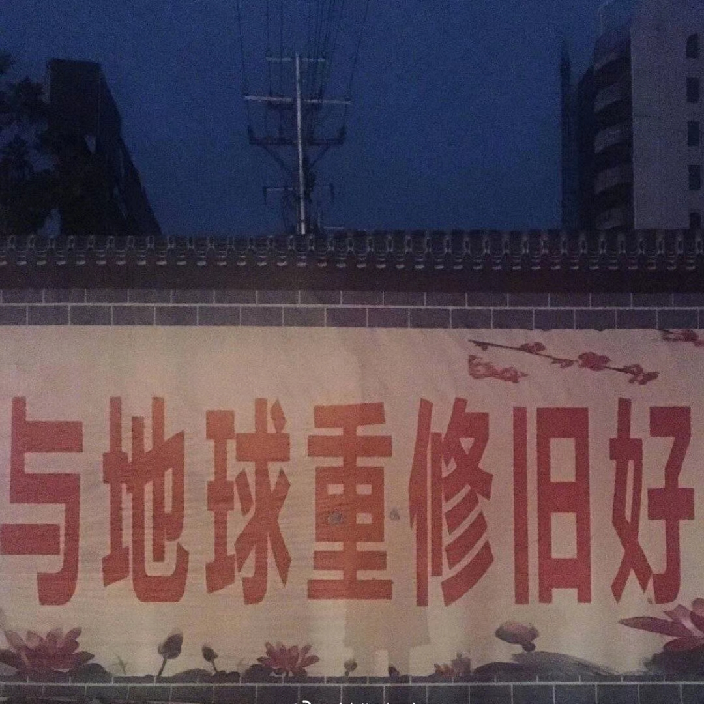

  

晚上好，最近天气变化扁桃体不慎发炎，和口腔溃疡一起折磨了我一段时间，还未痊愈就计划着把偶尔锻炼的频率修改成每天；

前两天因为落枕，夜里偶尔会醒，醒了又睡不着的时候翻了翻备忘录，突然有点挂念家人，可能只是夜里四下无人情绪被放大，疫情至今发生了很多刷新认知的事情，理所应当的事变得遥遥无期，一些唾手可得渐而不可即，明天可能会播报突发新闻，可能会发生糟糕的事，该怎么办呢？总之早上起来先说句「早上好」吧；

昨天早上下楼买早餐的时候偶遇了一个考研的朋友，顺势一起吃早餐聊了会天，他提到自己因为复习计划执行不周起了弃考的念头，掺杂了一点对同龄人找到好工作的羡慕，陷进了因沉没成本产生的自我怀疑里，又因为已经报名到了冲刺阶段告诉自己不能摆烂，他和我说这个，大概也希望我能劝劝他再坚持一会不要放弃，消除焦虑的最好办法其实就是行动起来，不必担心结果存在的不确定性，当到终点的时候回头看的时候，自然而然会发现一路上你撒下的种子盛开的花朵，只不过有的人撒下的长出了玫瑰，有的人结出的是无花果，不重要，都有收获；

随着岁数的增长和风霜历经，心好像也被打磨得越来越坚硬了，小时候就存在至今的问题，❤️ 的形状，顶部是圆的，底部却是尖的，可爱又令人痛苦，实际上是个表示「扭曲关系」的符号吧哈哈，气温变低了，每每看到宿舍楼下形形色色的‘’扭曲关系人‘’，心里想着这大概是个ハート相通（心意相通）的季节了吧；

晚安:)