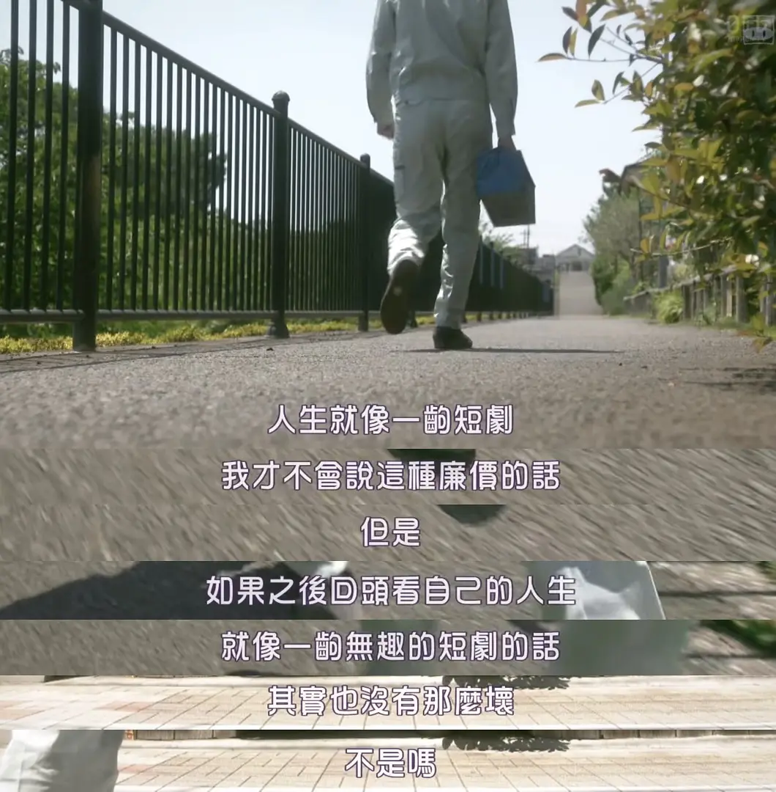
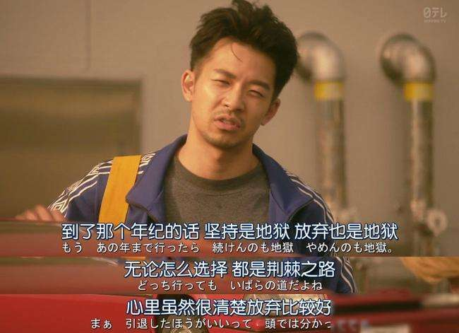
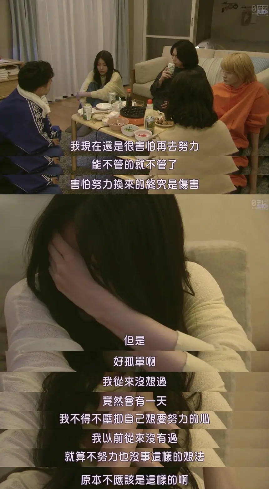

  

好久不见，你好吗？

前不久夜里写了一篇2021年度的总结，迷迷糊糊发布之后又把时间改成了2020年

醒来才发现原来已经是2022年了，于是草草地把推文删了

是啊，已经是2022年了啊

今天有个朋友突然找我讨论“努力有没有回报呢”这个话题

成功的人认为努力必有回报，失败的人则会保持不一定有回报的反对意见

实际上他是持反对意见的一方，小时候或者更年轻一点的时候还能够自我安慰，说着下次再加油什么的

现在已经不会觉得下次会更好了

“你可以做到的”、“加油”…

每次听到这些话，都觉得很痛苦，这明明是他人的善意啊

小时候只要得到奖励就会很开心，虽然很辛苦，但是有努力过真的太好了

为什么长大以后就没有奖励了呢

 

我听着他这样的话也好好思考了一下，突然想写点什么

通宵回到家里，窗外下着淅淅沥沥的雨，我想

如果有需要打着伞低头的日子，大概也会有淋着雨唱歌的日子吧

要是这个时候出现彩虹就好了呀，不过不出现才是现实吧

这让我想起去年一部我最爱的日剧《短剧开始啦》

  

我的观点和这部剧里的传达出来的观点一致——「我觉得努力有时也是这样，可能不是没有回报而是没有在我们所预想到的时机或方式出现」

所有人都在努力哦，所以努力也不值得被夸耀了

我大字躺在床上，插上耳机打开雨声助眠歌单，给他发了一句「但行好事，莫问前程」

