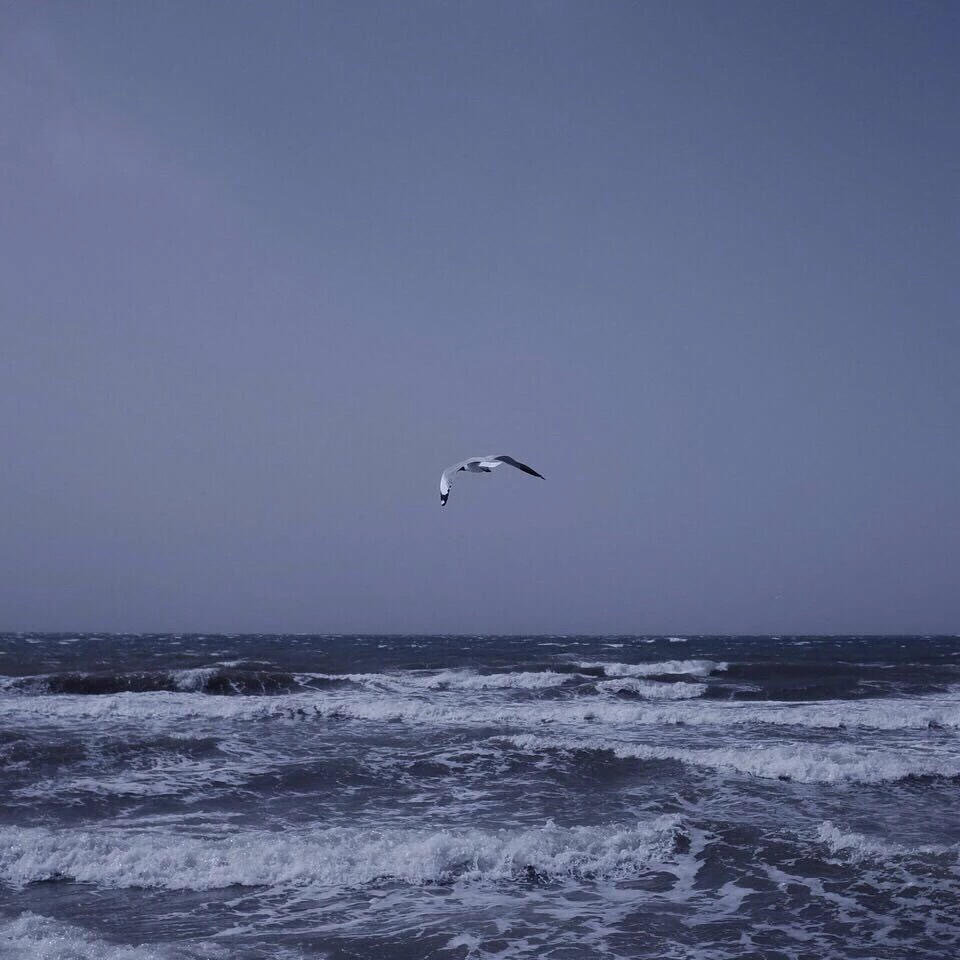
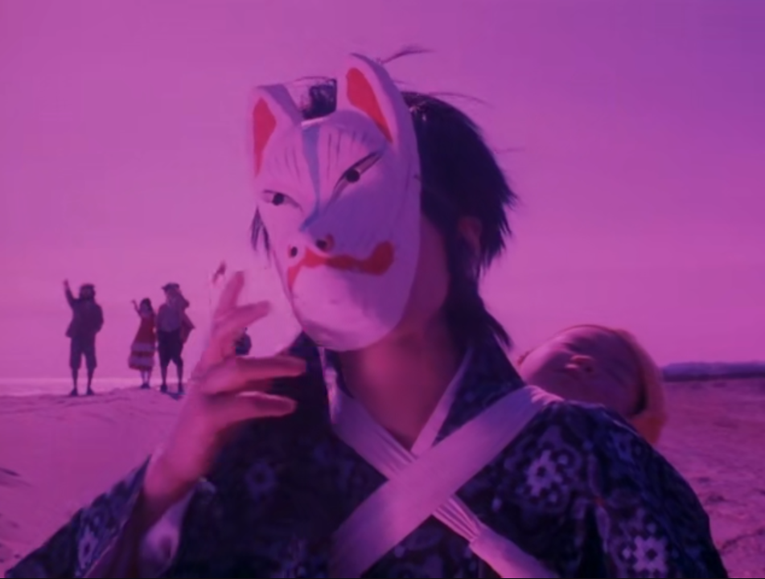
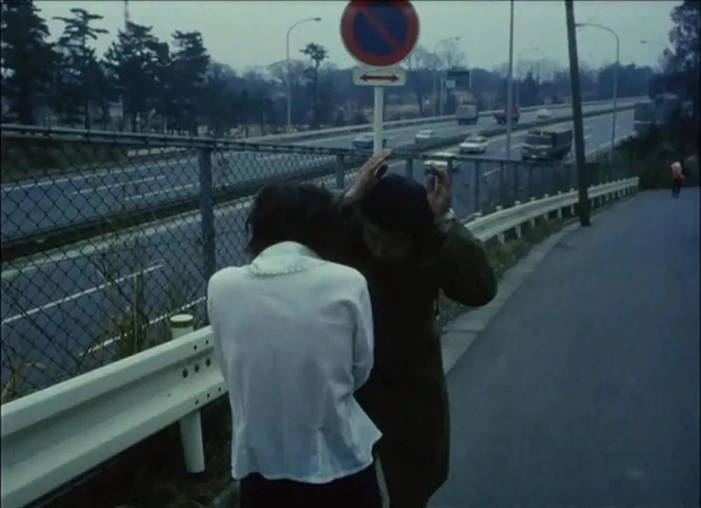

## 碎片小记

海是巨大的遗失物

由于实在太大了

无论哪家遗失物收容所

都不肯收留

## 夏时令

把讨厌的人的名字写在贝壳上

放到海里漂流

那个人就不能再待在城市里

这是在书里读到的

古雅典人的

贝壳放逐的故事

## 关于海鸥的序章

你听说过在海里死去的人都会变成海鸥的传闻吗？

## 海水与眼泪的比较研究

海是凋零，眼泪是复活

## 小小的恋爱故事

恋爱的另一个名字叫做妖怪

## 悲伤

在我写的诗里，都有家。可是我真是个无家可归的孩子。

在我写的诗里都有女人，可是我真是独自一人。
