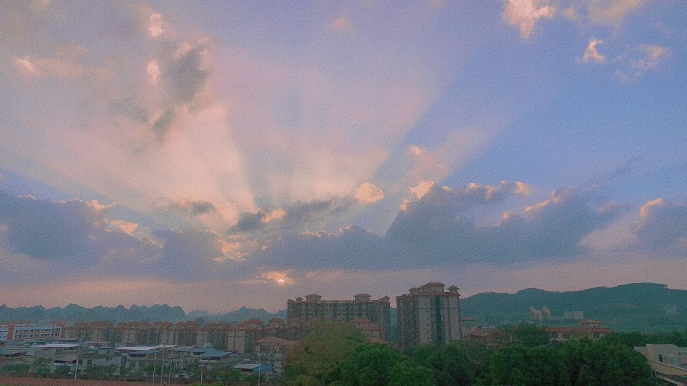

最近如何，你好吗？

我住的城市最近天气很好，喜欢傍晚时分，云铺满折叠过又展开的天空，零落的星剪碎后被拼接在树梢头，月色澄澈；

快毕业了，一些事情也才后知后觉，比如才发现某个食堂的某个菜式还没尝过，比如班上有几个同学在我这仍是‘无名之辈’，又比如原来不知不觉像这样的连篇废话我写了快四年；

我不太清楚自己写的内容是否足够引起共鸣达到共情，我只是有意无意地把这里当成一个树洞，刻画重复枯燥生活里一些有趣的瞬间，记录着自己的感动，保持着自己能为某事热泪盈眶的感性活力，再回头看时，会更确定这就是‘我’；

我的灵感大多来自于生活上的观察，睡不着时的天马行空，离谱的梦，自身难忘的经历以及朋友有趣的值得一提的故事；

有朋友说我文笔不算好的，也有说我排版很随意的，也说过反正没人看不如别写了的大实话，但我还是自娱自乐地一直坚持到了最近，直到他说“你十几的阅读量里有我贡献的一份噢”；

最近有在看渡边纯一的一本书《钝感力》，他说「对眼前的事物钝感一点，不要什么都往心里想」于是我学着培养自己的钝感力，缝上了嘴巴，上紧了心的拉链，克制自己的诉说欲和分享欲，每天自律地锻炼身体，培养闹铃响马上起床的能力，慢慢地我的烦恼是少了，但好像我也并不快乐，只有输入没有输出，连简单写点什么这件事，我都有点不知所言无从下笔，大概我从器官上到感官上都是一个不失敏感的人；

冰天冻地的朝晨里哈出的一口白气，是我真真切切活着的证明；鼻炎发作涕泗横流的夜晚是季节在窃窃私语悄然交替，蜂蝶连夜奔赴花间丛林；午后傍晚垂暮的夕阳，想起他来过人间一趟……

我是成为不了一个后天迟钝的人的；

他知道在「人间别久不成悲」中文字的排版很小，是因为有意要把悲伤放小，「不知道该怎么难过这件事反而让我更难过」这句话戳到了他的心里；

大概也会有人因为看了「樱桃味可乐」而喜欢上喝可乐，因为「五仁月饼」拨响了回家的一通电话，因为「布洛芬」想起生命中温暖过自己某个时刻的那些人；

这些零零散散的文字像海子诗里形容的太阳，有人普照沐浴，有人急忙打伞；

我还是会继续写，写淡淡的生活，淡淡的故事，真实斐然，写再回过头看时自己会露出呲牙咧嘴大笑表情的文字；

晚安:）
