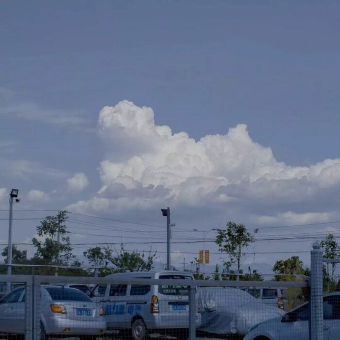
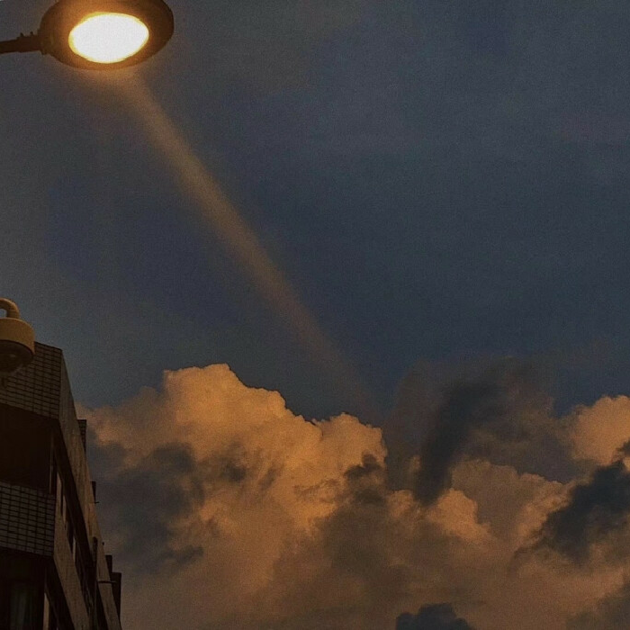
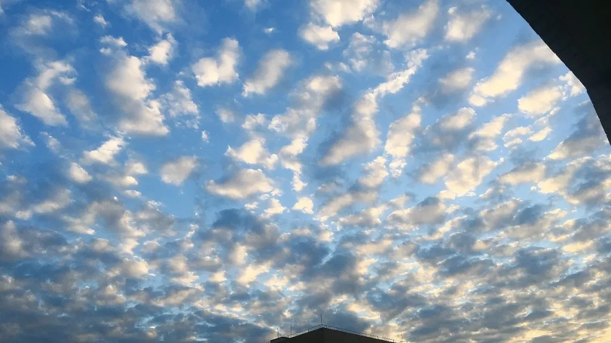

好久不见 你好吗？

此时此刻的我刚爬上床，拉上满是星星的床帘，打算写点什么后奔赴梦里银河；

不知道你有没有过这样的体验，未曾经历过的事情或场景仿佛在某时某地经历过，又或者平时路过的某家小店明明没有记错地址却突然找不到了，法语有个词语叫 dejavu ，中文翻译成即视感，而最近看的一本科幻小说把这种现象用波函数坍缩解释为时间旅行，就像是重力有方向一样，时间也有方向，只要破坏掉大脑中感知方向的部分，理论上就有可能实现时间旅行，也就是说意识控制时间；

而 dejavu 就是在连续的时间意识在跳跃的结果；

纵然有点伪科学偏唯心的感觉，但想想确实很有意思，给我的感觉就像是 彼时彼刻 仿如此时此刻；

前不久，找了一个闲暇的下午逛了一趟书店，在书店二层的角落拿起一本科普文本看了一下午，是一本很有意思的《云朵收集手册》，教你如何识别各种各样的云 ☁️，用积分制的形式鼓励你打卡记录每天的天空，不知不觉想起了小学时的课文《看云识天气》，特别有意思；

知识可以拓宽自己的视野，给生活添加趣味，看到满庭花开能识别出各种花草的名字，脑中自然而然地联想到对应的花语，于我而言是一件特别值得开心的事，相应的看云识天气，对身边各种事物的天马行空浮想联翩也是，这是知识本身存在的魅力；

不知道你对"余生皆假期"有什么看法，在看这本书之前，其实我对此也没什么看法；

保持童心真的是一件很难的事，就像是小时候会被说‘’问题儿童‘’一样，长大后会被说‘’幼稚‘’‘’不成熟‘’，这本书会是我今年最大受感动的一本，仿佛找到了人生中解答难题的一把钥匙；

他会告诉你有问题儿童大概也意味着会有答案儿童，还有可能他人眼中的问题儿童其实才是答案儿童；

他会告诉你多管闲事，其实不是一件坏事；

他会告诉你其实免费才是最贵的东西；

他会告诉你：

石楠花的花语是保持警惕

香菜的花语是濒死的前兆

木棉的花语是珍惜

他会告诉你，花语这东西，如果对方不知道就根本没有意义；

如果生活很苦闷的话，倒不如适时放个假吧，要不就余生皆假期吧！

彼时彼刻，仿如此时此刻，祝我生日快乐，晚安 🌙

