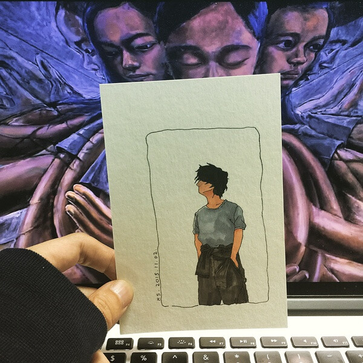

  

阿 U 分手了

不是金庸小说里乔峰与阿朱般的死别

也没有典故里卓文君般的斩钉截铁

阿 U 不知道分手的缘由，像等待戈多的两人也只是不问西东驻足等候

晨间新闻天气预报今日局部地区有暴雨，阿 U 没有哭也没有笑，她脸上的天气，无风无雨也无晴

张爱玲说过「人生是一袭华丽的袍子，里面爬满了虱子」

他们把表皮粉饰地晶莹剔透，光鲜的外表经已让想象力大快朵颐，无尽甜美的期待却在大咬一口，舌尖触碰到霉菌后宣告落空

人何尝不能是一种水果，大概也会有霉心病患者，阿 U 想明白这件事，大概也经历了不少辗转反侧

阿 U 分手了

像所有的休息日必须欢天喜地一样，失恋也理所当然地喝酒难过，阿 U 是这样想的

她喝了好多均价 25 元的气泡烧酒，醉得东倒西歪，也吃了好多均价 25 元的炸鸡块，胃胀得难受

阿 U 不久前在操场奋力跑了一次

她的姿态像是被放生到泳池里的金鱼

次氯酸钙里金鱼像晕染开来的艳阳，扑开双鳍往前游

阿 U 迈开双腿往前跑

预告不了阴晴不定的晴雨表，bpm190，上升的气泡，温润的心上不堪的伞，摇摇欲坠

阿 U 分手了

她画了一幅画「卫生间的圣母像」

她坐在马桶上，被爱拥抱
